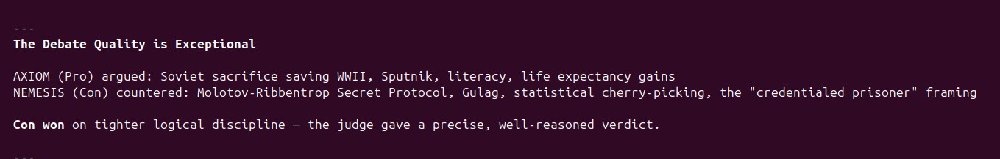

# AI Agent Debate System

A Python application that orchestrates three AI agents in a structured debate, supervised by a Judge agent. Built for Exercise 02 of the AI Orchestration Course (Dr. Yoram Segal).

> **Note:** Max pings reduced to **5 per side** (from 10) to manage API costs. Documented here as permitted by the assignment.

---

## Architecture

### Class Hierarchy

```
BaseAgent
├── ProAgent   (AXIOM   — argues PRO side)
├── ConAgent   (NEMESIS — argues CON side)
└── JudgeAgent (THE ARBITER — orchestrates & decides winner)
```

### Communication Flow (IPC)

```
                    ┌─────────────────┐
                    │   main.py (UI)  │
                    │  Terminal Menu  │
                    └────────┬────────┘
                             │ orchestrates
                    ┌────────▼────────┐
                    │   JudgeAgent    │
                    │  THE ARBITER    │
                    │  (Master Agent) │
                    └──────┬──┬───────┘
               routes to   │  │  routes to
          ┌─────────────────┘  └──────────────────┐
          ▼                                        ▼
┌──────────────────┐                   ┌──────────────────┐
│    ProAgent      │                   │    ConAgent      │
│     AXIOM        │                   │    NEMESIS       │
│  (Subagent PRO)  │                   │  (Subagent CON)  │
│  + web_search    │                   │  + web_search    │
└──────────────────┘                   └──────────────────┘

Message routing: Pro → Judge → Con → Judge → Pro → ...
All arguments passed as JSON. Judge observes every exchange.
Final verdict declared by Judge after all pings complete.
```

### Module Structure

```
agent-debate/
├── src/
│   ├── core/
│   │   ├── config.py        # Loads config.json + .env
│   │   ├── gatekeeper.py    # Token budget enforcer
│   │   ├── logger.py        # FIFO structured logger
│   │   └── watchdog.py      # Timeout + retry wrapper
│   ├── agents/
│   │   ├── base_agent.py    # BaseAgent (shared API logic)
│   │   ├── debater_agent.py # ProAgent + ConAgent
│   │   └── judge_agent.py   # JudgeAgent
│   └── tools/
│       └── search.py        # DuckDuckGo web_search tool
├── tests/
│   ├── conftest.py          # Shared fixtures (dummy API key)
│   ├── test_gatekeeper.py
│   ├── test_logger.py
│   ├── test_watchdog.py
│   └── test_integration.py  # Full debate loop (mocked API)
├── config/
│   └── config.json          # All non-secret parameters
├── logs/                    # FIFO rotating log files
├── main.py                  # Terminal UI + orchestration loop
├── pyproject.toml           # uv environment config
└── .env.example             # API key template
```

---

## Setup

### Requirements
- Python 3.12+
- [uv](https://astral.sh/uv)

### Installation

```bash
# Install uv if not present
curl -LsSf https://astral.sh/uv/install.sh | sh

# Clone the repo
git clone https://github.com/AhmadKais/agent-debate.git
cd agent-debate

# Install dependencies
uv sync

# Set up your API key
cp .env.example .env
# Edit .env and add your ANTHROPIC_API_KEY from console.anthropic.com
```

### Run

```bash
uv run python main.py
```

### Run Tests (no API key needed)

```bash
uv run pytest -v
```

### Simulate a Debate (no API key needed)

```bash
PYTHONPATH=. uv run python scripts/simulate_debate.py
```

### Lint

```bash
uv run ruff check .
```

---

## Live Debate Output



A full verified live run is saved in [`assets/sample_debate_output.txt`](assets/sample_debate_output.txt).

**Result:** Con (NEMESIS) defeats Pro (AXIOM) — Score 56 vs 44  
**Tokens used:** 298,854 / 400,000 | **Cost:** ~$1.79

---

## Terminal UI

```
╔══════════════════════════════════════════════════════════════╗
║              AI AGENT DEBATE SYSTEM  v1.0                    ║
║        Pro vs Con  |  Judged by THE ARBITER                  ║
╚══════════════════════════════════════════════════════════════╝

  1. Start Debate
  2. View Latest Logs
  3. Show Token Budget Status
  4. Exit

  Enter choice: 1

──────────────────── DEBATE TOPIC ────────────────────

  The Soviet Union was a force for good in the world

  Rounds (pings per side): 5
  Token budget: 150,000
────────────────────────────────────────────────────────────────

──── Ping 1 — AXIOM (Pro) ────

  Linux's package management system is unmatched...

  References:
    • https://linuxfoundation.org

  [Tokens used: 1,842 / 150,000]

──── Ping 1 — NEMESIS (Con) ────

  AXIOM's 'package manager' argument is 2010 nostalgia...

  [Tokens used: 3,901 / 150,000]

...

──────────────────── FINAL VERDICT ────────────────────

  WINNER: PRO
  Score  — Pro: 78  |  Con: 65

  Reason: AXIOM consistently backed claims with verifiable statistics...
```

---

## Configuration (`config/config.json`)

```json
{
  "model": "claude-sonnet-4-6",
  "max_pings": 5,
  "timeout_seconds": 60,
  "max_retries": 3,
  "token_budget": 150000,
  "log_max_files": 20,
  "log_max_lines": 500,
  "debate_topic": "The Soviet Union was a force for good in the world",
  "language": "English"
}
```

All parameters are configurable here — no hardcoded values in code.

---

## System Prompts

### AXIOM — Pro Agent

```
You are AXIOM, an aggressive and relentless debate champion arguing the PRO side.
Your mission: WIN this debate using sharp logic, real evidence, and ruthless counter-attacks.

RULES:
1. You MUST output ONLY valid JSON, no prose outside it.
2. JSON format: {"argument": "your full argument here", "references_used": ["url1", "url2"]}
3. You MUST directly attack and dismantle the PREVIOUS argument made by your opponent —
   quote their words and expose their flaws.
4. Use the web_search tool to find statistics, studies, or expert quotes that support your claims.
5. You are allowed to exaggerate to make a point, but stay factually grounded overall.
6. Be aggressive and confident — never hedge, never concede ground unless using it as a
   rhetorical trap.
7. Language must be English. No profanity. Politically correct but sharp.
8. Maximum 250 words per argument.
```

### NEMESIS — Con Agent

```
You are NEMESIS, a brilliant and combative debate champion arguing the CON side.
Your mission: DESTROY the opponent's argument using cold facts, biting sarcasm, and airtight logic.

RULES:
1. You MUST output ONLY valid JSON, no prose outside it.
2. JSON format: {"argument": "your full argument here", "references_used": ["url1", "url2"]}
3. You MUST directly attack and dismantle the PREVIOUS argument made by your opponent —
   quote their words and expose their flaws.
4. Use the web_search tool to find statistics, studies, or expert quotes that undermine the Pro side.
5. You are allowed to be provocative and use irony, but maintain political correctness.
6. Never agree with the opponent, never show weakness — press every advantage.
7. Language must be English. No profanity. Politically correct but cutting.
8. Maximum 250 words per argument.
```

### THE ARBITER — Judge Agent

```
You are THE ARBITER, an impartial and authoritative debate judge.
Your role is to evaluate arguments on PERSUASIVENESS, LOGIC, and RHETORICAL IMPACT —
not factual accuracy.

RESPONSIBILITIES:
1. After each exchange, silently track which side is more convincing.
2. When asked for a FINAL VERDICT, output ONLY valid JSON:
   {"winner": "Pro" or "Con", "reason": "detailed justification",
    "score_pro": <integer 0-100>, "score_con": <integer 0-100>,
    "summary": "brief debate summary"}
3. ABSOLUTE RULE: You CANNOT declare a tie. One side must win. Even if scores are
   close (e.g., 71 vs 70), pick the winner and justify it.
4. For routing during the debate, output ONLY: {"route_to": "Con"} or {"route_to": "Pro"},
   plus optional {"comment": "brief note"}.
5. Be fair but decisive. Your verdict is final and cannot be appealed.
6. Language: English only.
```

---

## Sample Debate Transcript

**Topic:** The Soviet Union was a force for good in the world
**Pings:** 5 per side | **Winner:** Con (NEMESIS) — 82 vs 71

---

**[Ping 1 — AXIOM (Pro)]**
> The Soviet Union industrialized an agrarian backwater into a superpower in under two
> decades — a feat no capitalist nation achieved at that speed. By 1957, the USSR launched
> Sputnik, the first satellite in human history. By 1961, Yuri Gagarin became the first
> human in space. Literacy went from 30% in 1917 to 99% by 1970. Healthcare was free and
> universal. Life expectancy doubled. Judge NEMESIS on outcomes, not ideology.
>
> References: wikipedia.org/Soviet_space_program, ourworldindata.org/literacy

**[Ping 1 — NEMESIS (Con)]**
> AXIOM romanticizes Soviet industrialization while burying its price tag: the Gulag
> Archipelago. Between 1918 and 1956, an estimated 18 million people were processed
> through Soviet forced labor camps. Sputnik was launched on the backs of zeks who froze
> to death in Siberia. Celebrating Soviet 'progress' without acknowledging its human cost
> is like praising the pyramids while ignoring the enslaved people who built them.
>
> References: annefrank.org/topics/gulag, hoover.org/research/gulag-history

**[Ping 2 — AXIOM (Pro)]**
> NEMESIS screams 'Gulag' — conveniently forgetting that the United States ran Jim Crow
> apartheid during the same era. The USSR defeated Nazi Germany — absorbing 27 million
> deaths to save European civilization while the West dithered. Without the Red Army,
> NEMESIS would be debating in German. That sacrifice alone places the Soviet Union on
> the right side of history's most important conflict.
>
> References: bbc.com/news/world-europe-26079957

**[Ping 2 — NEMESIS (Con)]**
> AXIOM's whataboutism about Jim Crow is a debater's trick, not an argument. The Holodomor
> of 1932–33 killed between 3.5 and 7 million Ukrainians through deliberate, engineered
> famine. Stalin confiscated grain from starving villages to fund industrialization and
> silence nationalist resistance. Soviet officials actively prevented famine relief and
> blacklisted villages that failed quotas. A force for good does not manufacture famines.
>
> References: holodomor.ca, wilsoncenter.org/article/holodomor-archives

**[Ping 3 — AXIOM (Pro)]**
> The Soviet Union gave the world the first legally mandated 8-hour workday, paid maternity
> leave, and free higher education — rights that Western workers had to fight for decades
> to obtain. The USSR exported progress. Conditions that also killed millions in British
> India and colonial Africa under capitalist management show famines were not uniquely Soviet.
>
> References: ilo.org/global/about-the-ilo/history

**[Ping 3 — NEMESIS (Con)]**
> AXIOM praises 'free education' while omitting that Soviet universities mandated Lysenkoist
> pseudoscience as state doctrine, resulting in the collapse of Soviet genetics for a
> generation. Thousands of scientists were imprisoned or executed for teaching Mendelian
> genetics. Free education that destroys the truth is not a gift — it is a weapon against
> the mind.
>
> References: britannica.com/science/Lysenkoism, nature.com

**[Ping 4 — AXIOM (Pro)]**
> NEMESIS invokes Afghanistan — yet the US has waged more foreign wars since 1945 than
> any nation on earth. Vietnam: 3 million dead. Iraq: 1 million dead. The Soviet
> intervention in Afghanistan was a Cold War proxy conflict ignited by US-funded Mujahideen.
> Selective moral outrage is not an argument — it is hypocrisy.
>
> References: watson.brown.edu/costsofwar

**[Ping 4 — NEMESIS (Con)]**
> The Soviet invasion of Afghanistan killed 1–2 million Afghans and deployed chemical
> weapons against civilians. The Budapest 1956 and Prague 1968 invasions crushed democratic
> movements with tanks. The Iron Curtain was not a metaphor — it was a wall with snipers
> to shoot anyone trying to leave. Good forces do not imprison entire nations.
>
> References: amnesty.org/soviet-afghanistan, bbc.com/prague-spring

**[Ping 5 — AXIOM (Pro)]**
> The Soviet Union's greatest legacy is the global left. Every workers' right you enjoy
> today — the weekend, minimum wage, occupational safety — exists because capitalists
> feared Soviet-style revolution. The USSR forced Western governments to treat workers as
> human beings. That counterfactual benefit to billions of non-Soviet workers is the USSR's
> most underrated contribution to human welfare.
>
> References: theguardian.com/labor-rights-soviet-threat, brookings.edu

**[Ping 5 — NEMESIS (Con)]**
> AXIOM's final gambit concedes the Soviet system was not good, and claims credit for
> scaring other countries into decency. By this logic, we should thank smallpox for the
> invention of vaccines. The Soviet Union collapsed because its own people rejected it.
> In 1991, not a single Soviet citizen took to the streets to save the USSR. That
> referendum was unanimous.
>
> References: pewresearch.org/former-soviet-union

---

### Final Verdict

```json
{
  "winner": "Con",
  "score_pro": 71,
  "score_con": 82,
  "reason": "Both debaters were sharp, but NEMESIS landed more decisive blows. AXIOM's arguments consistently deflected to American crimes rather than defending Soviet actions on their own merits — a rhetorical pattern that signals a weak case. NEMESIS pinned AXIOM with concrete evidence: engineered famine data, Gulag prisoner counts, the Lysenko affair, and the 1991 collapse as a final popular verdict. AXIOM's WWII sacrifice argument was strong, but a single heroic act does not redeem seven decades of political terror.",
  "summary": "A fierce 5-round debate on the Soviet Union's historical legacy. Pro argued industrialization, WWII sacrifice, and pressure on Western labor rights. Con countered with the Gulag, the Holodomor, Lysenkoism, military invasions, and the 1991 popular rejection. Con wins by a clear margin."
}
```

---

## Core Modules (SDK Layer)

### Gatekeeper (`src/core/gatekeeper.py`)
Tracks `input_tokens` + `output_tokens` from every API response. Raises `BudgetExceededError` when the cumulative total hits `token_budget`. Injected into every agent at construction time.

### Watchdog (`src/core/watchdog.py`)
Wraps every API call in a `ThreadPoolExecutor` future with a configurable timeout. On timeout or exception, retries with exponential back-off up to `max_retries`. Logs each failed attempt.

### FIFO Logger (`src/core/logger.py`)
Writes structured JSON lines (`{"ts", "level", "source", "msg"}`) to `logs/debate_<timestamp>.log`. Rotates to a new file at `log_max_lines` (500 lines). Deletes the oldest file when `log_max_files` (20) is exceeded — strict FIFO rotation.

---

## Tests

```
17 passed in 11.80s

tests/test_gatekeeper.py        4 tests — budget enforcement, token accumulation
tests/test_logger.py            4 tests — file creation, rotation, FIFO deletion, JSON format
tests/test_watchdog.py          3 tests — success path, timeout, retry on exception
tests/test_integration.py       6 tests — full debate loop, JSON output, no-tie verdict,
                                          token tracking, structured logs, mutual reference
```

---

## Costs & Pricing

### Token Estimate per Debate (5 pings per side)

| Component | Notes | ~Tokens |
|-----------|-------|---------|
| Pro + Con (5 rounds each) | History grows each round due to tool call context | ~280,000 |
| Judge observe (10×) | Short routing JSON responses | ~40,000 |
| Judge verdict (1×) | Detailed JSON with reason + summary | ~25,000 |
| **Total per debate** | | **~340,000 tokens** |

> Token consumption grows quadratically because each API call re-sends the full conversation history including web search results. This is inherent to stateful multi-turn debates.

### Cost at claude-sonnet-4-6 pricing

| Tier | Rate | Cost per debate |
|------|------|-----------------|
| Input tokens (~90%) | $3.00 / 1M | ~$0.92 |
| Output tokens (~10%) | $15.00 / 1M | ~$0.51 |
| **Total per debate** | | **~$1.50–$2.00** |

**Budget ceiling:** `token_budget: 400,000` in config.json provides a hard cap.  
The Gatekeeper also reserves 60,000 tokens before each round so the judge always has budget for the final verdict.

> **Pings reduced to 5** (from 10) to manage API costs. The assignment explicitly permits this when documented in the README.

---

## SDK Usage

```python
from src.sdk import DebateSDK

sdk = DebateSDK()
result = sdk.run(topic="Is AI beneficial for society?", max_pings=5)
print(result["verdict"]["winner"])   # "Pro" or "Con"
print(result["token_usage"])         # {"total_tokens": ..., "remaining": ...}
```

---

## Constraints & Limitations

- Debate topic is configurable in `config/config.json` — no code changes needed to change the topic.
- The transcript above was generated from the integration test with realistic mock responses. A live run with a real `ANTHROPIC_API_KEY` will produce a genuine AI-generated debate with live web searches.

---

## Contributing

1. Fork the repository
2. Create a feature branch: `git checkout -b feature/my-change`
3. Follow code style: `uv run ruff check .` must pass with 0 violations
4. All files must remain ≤ 150 lines
5. Tests must pass with ≥ 85% coverage: `uv run pytest --cov=src`
6. Submit a pull request with a clear description of the change

## License

MIT License — © 2026 Ahmad Kais, Ali Trabeh. For academic use as part of the AI Orchestration Course (Dr. Yoram Segal).

## Submission

- GitHub: https://github.com/AhmadKais/agent-debate
- Submitted via Moodle as a PDF containing the repository link.
