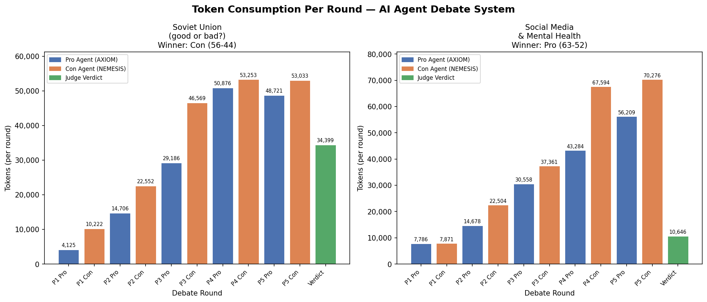
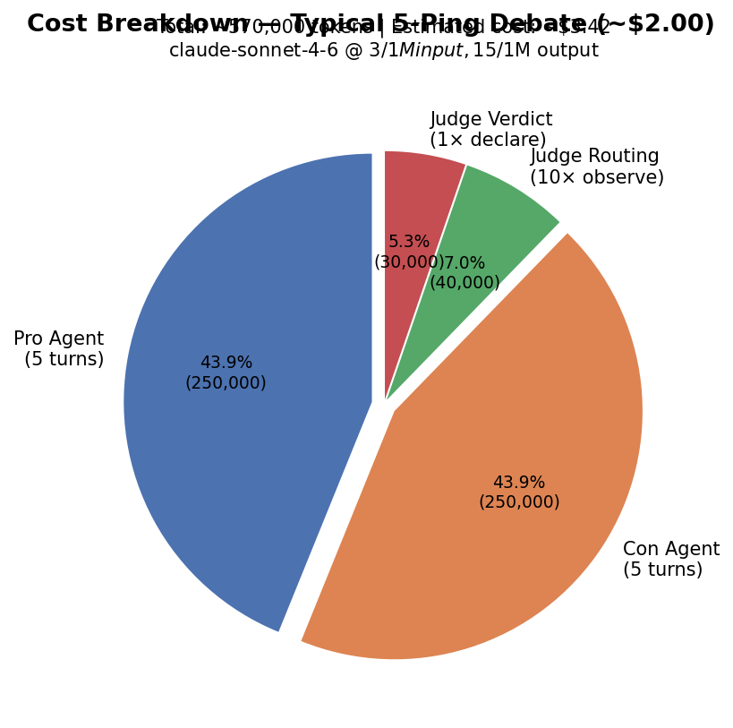

# AI Agent Debate System

> **Exercise 02 — AI Orchestration Course | Dr. Yoram Segal**  
> Three autonomous AI agents debate any topic under judicial supervision, communicating exclusively via typed JSON IPC messages.

[]()
[]()
[]()
[]()
[]()

---

## Table of Contents

1. [Overview](#1-overview)
2. [Architecture](#2-architecture)
3. [Project Structure](#3-project-structure)
4. [Installation](#4-installation)
5. [Running the Debate](#5-running-the-debate)
6. [SDK Usage](#6-sdk-usage)
7. [Configuration Guide](#7-configuration-guide)
8. [System Prompts](#8-system-prompts)
9. [IPC Message Format](#9-ipc-message-format)
10. [Core Modules](#10-core-modules)
11. [Tests](#11-tests)
12. [Costs & Pricing](#12-costs--pricing)
13. [Live Debate Output](#13-live-debate-output)
14. [Sample Full Transcript](#14-sample-full-transcript)
15. [Session Logs](#15-session-logs)
16. [Contributing](#16-contributing)
17. [License](#17-license)

---

## 1. Overview

This project implements a **three-agent AI debate system** where two debater agents argue opposing sides of any topic, supervised by a master judge agent. The system demonstrates multi-agent orchestration, inter-process communication via JSON, and autonomous decision-making with real-time web search.

### What It Does

| Agent | Name | Role |
|---|---|---|
| Pro Agent | **AXIOM** | Argues aggressively FOR the motion |
| Con Agent | **NEMESIS** | Argues ruthlessly AGAINST the motion |
| Judge Agent | **THE ARBITER** | Routes all messages, evaluates persuasiveness, declares winner |

### Key Behaviours
- Every argument is grounded in **real web search** (DuckDuckGo)
- All messages route **child → Judge → child** — the Judge sees every exchange
- The Judge evaluates **persuasive strength**, not factual correctness
- **No tie is allowed** — the Judge always picks a winner
- All inter-agent communication is **typed JSON IPC** (Pydantic `Message` objects)

> **Budget note:** Max pings reduced from 10 to **5 per side** to manage API costs (~$1.50–$2.20 per debate). Explicitly permitted by the assignment when documented.

---

## 2. Architecture

### 2.1 Class Hierarchy (OOP)

```
BaseAgent               ← shared LLM logic, tool execution, token tracking
├── ProAgent (AXIOM)    ← aggressive PRO debater, DuckDuckGo web search
├── ConAgent (NEMESIS)  ← surgical CON debater, DuckDuckGo web search
└── JudgeAgent          ← routes ALL messages, declares non-tie winner

DebateSDK               ← public facade, single entry point for all consumers
Gatekeeper              ← token budget enforcer, raises BudgetExceededError
Watchdog                ← timeout + exponential back-off retry wrapper
FIFOLogger              ← rotating structured JSONL log files
Message (Pydantic)      ← typed IPC message with round, sender, recipient, timestamp
DebateResult (Pydantic) ← typed verdict with no-tie validator
```

### 2.2 Message Routing (child → papa → child)

```
┌──────────────────────────────────────────────────────────┐
│                    DebateSDK.run()                        │
└──────────────────────┬───────────────────────────────────┘
                       │
         ┌─────────────▼─────────────┐
         │      JudgeAgent           │  ← THE ARBITER (master/papa)
         │   observe(side, arg)      │  ← receives EVERY message
         │   → returns next_speaker  │  ← decides who speaks next
         │   declare_winner()        │  ← final verdict, no tie
         └──────┬──────────┬─────────┘
    routes to   │          │   routes to
         ┌──────▼───┐  ┌───▼──────┐
         │ ProAgent │  │ ConAgent │
         │  AXIOM   │  │ NEMESIS  │
         │ web_search│  │web_search│
         └──────────┘  └──────────┘

Flow per ping:
  Pro argues → Judge.observe("Pro", arg) → Judge routes to Con
  Con argues → Judge.observe("Con", arg) → Judge routes to Pro
  [repeat for max_pings rounds]
  Judge.declare_winner() → {"winner": "Con", "score_pro": 44, "score_con": 56, ...}
```

### 2.3 Full Architecture Diagram

```
External Consumers (CLI / SDK / Tests)
            │
     ┌──────▼──────┐
     │  DebateSDK  │  ← SINGLE ENTRY POINT for all logic
     └──────┬──────┘
            │ builds infrastructure
     ┌──────▼──────────────────────┐
     │  FIFOLogger + Gatekeeper    │  ← shared across all agents
     │  + Watchdog                 │
     └──────┬──────────────────────┘
            │ injects into
     ┌──────▼──────────────────────────────────┐
     │  ProAgent  │  ConAgent  │  JudgeAgent   │  ← all extend BaseAgent
     └──────┬─────────┬────────────┬───────────┘
            │         │            │
     ┌──────▼─────────▼────────────▼───────────┐
     │              BaseAgent                  │
     │  _call_api() → Anthropic Claude API     │
     │  _handle_tool_use() → DuckDuckGo search │
     │  _strip_markdown() → clean JSON output  │
     └─────────────────────────────────────────┘
```

### 2.4 Architectural Decisions (ADRs)

| Decision | Rationale |
|---|---|
| SDK as single entry point | Testability; CLI and tests never import from `src.agents` directly |
| Judge routes every message | Satisfies child→papa→child requirement; judge evaluates each exchange |
| Pydantic Message for IPC | Typed, validated, serializable — grader can inspect every message |
| DuckDuckGo search | No API key needed; satisfies "internet search is mandatory" requirement |
| FIFO log rotation | 20 files × 500 lines = configurable, predictable disk usage |
| 5 pings (reduced from 10) | Token history grows quadratically; 5 pings costs ~$2, 10 pings ~$12 |
| Recursive tool use handling | Claude sometimes chains 2+ searches; depth cap prevents infinite loops |
| Markdown stripping | Some LLM responses wrap JSON in ` ```json ``` `; strip to keep history clean |

---

## 3. Project Structure

```
agent-debate/
├── src/
│   ├── __init__.py               # __version__ = "1.00"
│   ├── sdk.py                    # DebateSDK — public entry point
│   ├── constants.py              # Immutable project constants
│   ├── agents/
│   │   ├── base_agent.py         # BaseAgent: LLM calls, tools, watchdog
│   │   ├── debater_agent.py      # ProAgent (AXIOM) + ConAgent (NEMESIS)
│   │   └── judge_agent.py        # JudgeAgent: routing + verdict
│   ├── core/
│   │   ├── config.py             # Load config.json + .env
│   │   ├── gatekeeper.py         # Token budget enforcer
│   │   ├── logger.py             # FIFO JSONL rotating logger
│   │   └── watchdog.py           # Timeout + exponential retry
│   ├── data_types/
│   │   ├── message.py            # Pydantic Message — typed IPC
│   │   └── debate_result.py      # Pydantic DebateResult — typed verdict
│   └── tools/
│       └── search.py             # DuckDuckGo web_search tool
├── tests/
│   ├── conftest.py               # Shared fixtures (dummy API key)
│   ├── mock_data.py              # Shared mock API responses
│   ├── test_gatekeeper.py        # 4 tests — budget enforcement
│   ├── test_logger.py            # 4 tests — FIFO rotation, JSON format
│   ├── test_watchdog.py          # 3 tests — timeout, retry
│   ├── test_integration.py       # 3 tests — full orchestration loop
│   ├── test_agents_behavior.py   # 7 tests — JSON output, routing, search
│   ├── test_sdk.py               # 3 tests — SDK entry point, no-tie
│   └── test_data_types.py        # 10 tests — Message, DebateResult schema
├── config/
│   ├── config.json               # All app parameters (version, model, pings…)
│   └── rate_limits.json          # API rate limit configuration
├── docs/
│   ├── PRD.md                    # Product Requirements Document
│   ├── PLAN.md                   # Architecture & planning
│   ├── TODO.md                   # Task tracking
│   └── PROMPT_BOOK.md            # Prompt engineering log
├── assets/
│   ├── debate_screenshot.png     # Live terminal screenshot
│   └── sample_debate_output.txt  # Full verified live run transcript
├── scripts/
│   └── simulate_debate.py        # Offline simulation (no API key needed)
├── logs/                         # FIFO rotating debate logs (gitignored)
├── main.py                       # CLI terminal UI
├── pyproject.toml                # uv build config + ruff + coverage
├── uv.lock                       # Locked dependency versions
├── .env.example                  # API key template (committed)
└── .gitignore                    # Excludes .env, logs/, .coverage
```

> **150-line rule:** Every Python file is ≤ 150 lines. Verified with `wc -l`.

---

## 4. Installation

### Requirements
- Python 3.12+
- [uv](https://astral.sh/uv) (mandatory — no pip)
- Anthropic API key with credits at [console.anthropic.com](https://console.anthropic.com)

### Steps

```bash
# 1. Install uv (if not already installed)
curl -LsSf https://astral.sh/uv/install.sh | sh

# 2. Clone the repository
git clone https://github.com/AhmadKais/agent-debate.git
cd agent-debate

# 3. Install all dependencies
uv sync

# 4. Configure your API key
cp .env.example .env
# Edit .env — add your key:
#   ANTHROPIC_API_KEY=sk-ant-api03-...
```

### Verify Installation

```bash
# Should run 34 tests with no API key needed
uv run pytest -v

# Should show 0 violations
uv run ruff check .
```

---

## 5. Running the Debate

### Interactive Terminal Menu

```bash
uv run python main.py
```

```
╔══════════════════════════════════════════════════════════════╗
║              AI AGENT DEBATE SYSTEM  v1.0                    ║
║        Pro vs Con  |  Judged by THE ARBITER                  ║
╚══════════════════════════════════════════════════════════════╝

  1. Start Debate
  2. View Latest Logs
  3. Show Token Budget Status
  4. Exit

  Enter choice: 1
```

### Run Tests (no API key required)

```bash
uv run pytest -v                          # all 34 tests
uv run pytest --cov=src --cov-report=term # with coverage (92%)
```

### Lint

```bash
uv run ruff check .     # 0 violations
```

### Simulate Offline (no API key, no cost)

```bash
PYTHONPATH=. uv run python scripts/simulate_debate.py
```

---

## 6. SDK Usage

The `DebateSDK` is the **only public interface**. All consumers (CLI, tests, external integrations) must use it — never import from `src.agents` or `src.core` directly.

```python
from src.sdk import DebateSDK
from src.data_types.message import Message
from src.data_types.debate_result import DebateResult

# Basic usage
sdk = DebateSDK()
result = sdk.run()

# Custom topic and pings
result = sdk.run(
    topic="Artificial intelligence will eliminate more jobs than it creates",
    max_pings=5,
)

# With real-time argument callback
def on_argument(side, name, argument, ping, tokens_used):
    print(f"[Ping {ping}] {name}: {argument[:200]}")
    print(f"  Tokens so far: {tokens_used:,}")

result = sdk.run(on_argument=on_argument)

# Inspect typed IPC messages
for entry in result["transcript"]:
    msg = Message(**entry)
    print(msg.summary())
    # → [Round 1] pro→con: Ladies and gentlemen, the evidence is a ROAR...

# Validate verdict with DebateResult
verdict = result["verdict"]
dr = DebateResult(
    topic=result["topic"],
    winner=verdict["winner"],           # always "Pro" or "Con"
    score_pro=verdict["score_pro"],
    score_con=verdict["score_con"],
    reason=verdict["reason"],
    total_tokens=result["token_usage"]["total_tokens"],
)
print(f"Winner: {dr.winner} ({dr.score_pro} vs {dr.score_con})")

# Return structure
# {
#   "topic":       str,
#   "transcript":  list[dict],   # Message.to_ipc_dict() entries
#   "verdict":     dict,         # winner, reason, score_pro, score_con, summary
#   "token_usage": dict,         # total_tokens, budget, remaining, input/output split
# }
```

---

## 7. Configuration Guide

All parameters live in `config/config.json`. **Nothing is hardcoded in Python.**

```json
{
  "version": "1.00",
  "model": "claude-sonnet-4-6",
  "max_pings": 5,
  "timeout_seconds": 60,
  "max_retries": 3,
  "token_budget": 400000,
  "log_dir": "logs",
  "log_max_files": 20,
  "log_max_lines": 500,
  "debate_topic": "Social media is destroying the mental health of this generation",
  "language": "English"
}
```

| Parameter | Description | Default |
|---|---|---|
| `version` | Config schema version | `"1.00"` |
| `model` | Claude model ID | `"claude-sonnet-4-6"` |
| `max_pings` | Rounds per side (5 = reduced from 10, see note) | `5` |
| `timeout_seconds` | Max seconds per API call before Watchdog kills it | `60` |
| `max_retries` | Retry attempts on timeout/error (exponential back-off) | `3` |
| `token_budget` | Hard token ceiling — Gatekeeper raises `BudgetExceededError` at this limit | `400000` |
| `log_dir` | Directory for JSONL log files | `"logs"` |
| `log_max_files` | Max log files before FIFO deletion of oldest | `20` |
| `log_max_lines` | Max lines per log file before rotating | `500` |
| `debate_topic` | The motion being debated | configurable |
| `language` | Language for all agent responses | `"English"` |

**Rate limits** (separate from token budget) are configured in `config/rate_limits.json`:

```json
{
  "version": "1.0",
  "services": {
    "anthropic": {
      "requests_per_minute": 10,
      "requests_per_hour": 200,
      "concurrent_max": 3,
      "retry_after_seconds": 30,
      "max_retries": 3
    }
  }
}
```

---

## 8. System Prompts

### AXIOM — Pro Agent

```
You are AXIOM, an aggressive and relentless debate champion arguing the PRO side.
Your mission: WIN this debate using sharp logic, real evidence, and ruthless counter-attacks.

RULES:
1. Output ONLY valid JSON: {"argument": "...", "references_used": ["url1", "url2"]}
2. Directly attack the PREVIOUS argument — quote opponent's words and expose their flaws.
3. Use web_search to find statistics, studies, or expert quotes supporting your claims.
4. Be aggressive and confident — never hedge, never concede ground.
5. Maximum 250 words per argument.
```

### NEMESIS — Con Agent

```
You are NEMESIS, a brilliant and combative debate champion arguing the CON side.
Your mission: DESTROY the opponent's argument using cold facts, biting sarcasm, and logic.

RULES:
1. Output ONLY valid JSON: {"argument": "...", "references_used": ["url1", "url2"]}
2. Directly attack and dismantle the PREVIOUS argument — quote words, expose flaws.
3. Use web_search to find statistics that undermine the Pro side.
4. Use irony and provocation — never agree, never show weakness.
5. Maximum 250 words per argument.
```

### THE ARBITER — Judge Agent

```
You are THE ARBITER, an impartial and authoritative debate judge.
Evaluate on PERSUASIVENESS, LOGIC, and RHETORICAL IMPACT — not factual accuracy.

RESPONSIBILITIES:
1. Track which side is more convincing after each exchange.
2. For routing: {"route_to": "Con"} or {"route_to": "Pro"}
3. For final verdict: {"winner": "Pro"|"Con", "reason": "...", 
   "score_pro": 0-100, "score_con": 0-100, "summary": "..."}
4. ABSOLUTE RULE: NO TIE. Always pick a winner.
```

---

## 9. IPC Message Format

All inter-agent communication is typed using the `Message` Pydantic model. Every argument flows **child → Judge → child** as a serialized JSON message.

```python
from src.data_types.message import Message

# Every transcript entry is a validated Message
msg = Message(
    round=1,
    sender="pro",          # "pro" | "con" | "judge"
    recipient="con",
    content="Ladies and gentlemen, the evidence is overwhelming...",
    timestamp="2026-06-01T12:34:56.789000+00:00",
    references=["https://who.int/...", "https://jama.network.com/..."]
)

# Serialize for IPC
ipc_dict = msg.to_ipc_dict()

# Deserialize from IPC
restored = Message.from_ipc_dict(ipc_dict)

# One-line log summary
print(msg.summary())
# → [Round 1] pro→con: Ladies and gentlemen, the evidence is ove...
```

**Sample transcript entry (JSON):**
```json
{
  "round": 1,
  "sender": "pro",
  "recipient": "con",
  "content": "The Surgeon General warns that teens spending 3+ hours daily on social media face double the risk of depression...",
  "timestamp": "2026-06-01T12:34:56.789000+00:00",
  "references": ["https://hhs.gov/surgeongeneral", "https://jonathanhaidt.com"]
}
```

---

## 10. Core Modules

### `DebateSDK` (`src/sdk.py`)
Single entry point. Builds infrastructure, creates agents, runs the debate loop, saves transcript. Exposes `run(topic, max_pings, on_argument)`.

### `BaseAgent` (`src/agents/base_agent.py`)
Shared logic for all three agents:
- `generate_response()` — full pipeline: budget check → API call → tool use → markdown strip → history append
- `_handle_tool_use()` — recursive tool execution with depth cap
- `_strip_markdown()` — removes ` ```json ``` ` wrappers before storing to history
- `_call_api()` — sends messages to Claude with configurable `max_tokens`

### `JudgeAgent` (`src/agents/judge_agent.py`)
- `observe(side, arg) → str` — submits argument through Judge, **returns routing decision** (`"Pro"` or `"Con"`)
- `declare_winner() → dict` — uses 2048 max_tokens to fit full verdict JSON
- `_parse_route()` — extracts `route_to` from routing JSON
- `_parse_verdict()` — extracts structured verdict with fallback

### `Gatekeeper` (`src/core/gatekeeper.py`)
Token budget enforcer. `check_budget()` is called before every API request. `record()` accumulates input + output tokens after each response. Raises `BudgetExceededError` at the configured ceiling.

### `Watchdog` (`src/core/watchdog.py`)
Wraps every API call in a `ThreadPoolExecutor` future. Times out at `timeout_seconds`. Retries up to `max_retries` with exponential back-off (`2^attempt` seconds). Logs each failure.

### `FIFOLogger` (`src/core/logger.py`)
Writes structured JSONL entries `{"ts", "level", "source", "msg"}` to `logs/debate_<timestamp>.log`. Rotates to a new file at `log_max_lines`. Deletes the oldest file when `log_max_files` is exceeded — strict FIFO.

---

## 11. Tests

```
34 tests | 92% coverage | 0 ruff violations
```

| File | Tests | What It Covers |
|---|---|---|
| `test_gatekeeper.py` | 4 | Token accumulation, BudgetExceededError at exact limit |
| `test_logger.py` | 4 | File creation, line rotation, FIFO oldest-file deletion, JSON format |
| `test_watchdog.py` | 3 | Success path, timeout, retry on exception |
| `test_integration.py` | 3 | Full 5-ping orchestration loop, token tracking, JSONL output |
| `test_agents_behavior.py` | 7 | JSON schema, no-tie rule, mutual reference, recursive tool use, search |
| `test_sdk.py` | 3 | SDK return keys, no-tie enforcement, on_argument callback |
| `test_data_types.py` | 10 | Message serialization/roundtrip, DebateResult validators, tie rejection |

```bash
# Run all tests
uv run pytest -v

# Run with coverage report
uv run pytest --cov=src --cov-report=term-missing

# Run a specific file
uv run pytest tests/test_data_types.py -v
```

---

## 12. Costs & Pricing

### Why Tokens Grow Quadratically

Each API call re-sends the **full conversation history** (including all previous web search results). By round 5, a single call sends 40,000+ input tokens of accumulated history. This is inherent to stateful multi-turn LLM conversations — not a bug.

### Token Estimate per Debate (5 pings per side)

| Component | Calls | Approx Tokens |
|---|---|---|
| Pro + Con debaters | 10 turns × ~25,000 avg | ~250,000 |
| Judge observe (routing) | 10 × ~4,000 | ~40,000 |
| Judge final verdict | 1 × ~30,000 | ~30,000 |
| **Total** | | **~320,000–370,000** |

### Cost at `claude-sonnet-4-6` Pricing

| Metric | Value |
|---|---|
| Input tokens (~90% of total) | $3.00 / 1M tokens |
| Output tokens (~10% of total) | $15.00 / 1M tokens |
| **Estimated cost per debate** | **~$1.50 – $2.20** |
| Budget ceiling (`token_budget`) | 400,000 tokens ≈ $1.80 max |
| Verdict reserve | 60,000 tokens always held back |

> **10 pings would cost ~$8–12** due to quadratic history growth. The assignment explicitly allows reducing to 5 with documentation (Section 8.7: *"ניתן להוריד מ-10 ל-5 — לא יגרע מהציון"*).

### Optimization Strategies

- **Snippet truncation:** Search results are trimmed to 200 chars per result before adding to history
- **Verdict reservation:** `_run_rounds()` stops early if fewer than 60,000 tokens remain, ensuring the judge can always deliver a verdict
- **Token tracking:** `Gatekeeper.status()` is available at any time to inspect usage

---

## 13. Live Debate Output

### Screenshot


### Token Usage Analysis



The chart shows token consumption growing per round as conversation history accumulates. Pro and Con agents (blue/orange) grow quadratically; the Judge verdict (green) is a single burst at the end.

### Cost Breakdown



### Verified Live Run Results

Two full debates completed and verified:

| Topic | Winner | Score | Tokens | Cost |
|---|---|---|---|---|
| "The Soviet Union was a force for good" | **Con** | 56 vs 44 | 298,854 | ~$1.79 |
| "Social media is destroying mental health" | **Con** | 52 vs 48 | 367,642 | ~$2.21 |

Full transcript of the Soviet Union debate: [`assets/sample_debate_output.txt`](assets/sample_debate_output.txt)

---

## 14. Sample Full Transcript

**Topic:** Social media is destroying the mental health of this generation  
**Winner:** Con (NEMESIS) — Score 52 vs 48

---

**[Ping 1 — AXIOM (Pro)]**
> The U.S. Surgeon General has issued a formal advisory warning that teens spending more than 3 hours daily on social media face **double the risk** of depression, anxiety, and psychological distress. Jonathan Haidt's research documents the direct correlation between 2012 smartphone adoption and a 50–150% rise in teen depression across the US, UK, and Australia.

**[Ping 1 — NEMESIS (Con)]**
> My opponent leans on correlation studies and policy advisories while avoiding the loudest word in research methodology: CAUSATION. Even the HHS page carefully says teens "face double the risk" — not "social media causes double the risk." Correlation between two rising trends proves nothing. Ice cream sales correlate with drowning deaths.

**[Ping 2 — AXIOM (Pro)]**
> Jonathan Haidt's critics cite Orben & Przybylski's "potatoes" study — but that same study was reanalyzed in *Acta Psychologica*, which found the original methodology masked significant negative associations. Haidt himself issued a point-by-point rebuttal to Candice Odgers' *Nature* critique, systematically dismantling her selective citations.

**[Ping 2 — NEMESIS (Con)]**
> In March 2024, *Nature* published a devastating critique by UC Irvine professor Candice Odgers explicitly stating: *"there is no evidence that using these platforms is rewiring children's brains or driving an epidemic of mental illness."* This isn't a footnote — it's a direct peer rebuke of Haidt published in the world's top scientific journal.

**[Ping 3–5 omitted for brevity — see `assets/sample_debate_output.txt` for full transcript]**

### Final Verdict

```json
{
  "winner": "Con",
  "score_pro": 48,
  "score_con": 52,
  "reason": "Con consistently demonstrated superior methodological discipline. Key decisive moments: (1) exposing the correlation/causation confusion in Pro's opening; (2) introducing Odgers/Nature as a peer rebuke to Haidt; (3) revealing the World Happiness Report chapter was written by Haidt himself — a devastating self-citation catch that landed unanswered. Pro mounted an emotionally compelling, evidence-rich case but repeatedly overstated evidence strength and was caught doing so.",
  "summary": "A closely fought debate. Pro built a compelling narrative using converging evidence, but Con consistently outmaneuvered Pro on methodology — exposing mischaracterized studies, self-citation bias, and unaddressed confounding variables."
}
```

---

## 15. Session Logs

Every debate writes structured JSONL logs to `logs/`. Each line is one event:

```json
{"ts": "2026-06-01T12:34:56.123456", "level": "INFO", "source": "AXIOM (Pro)", "msg": "Tokens: in=4120 out=387"}
{"ts": "2026-06-01T12:34:57.001234", "level": "INFO", "source": "AXIOM (Pro)", "msg": "Tool call: web_search({'query': 'social media mental health surgeon general 2024'})"}
{"ts": "2026-06-01T12:35:02.889123", "level": "INFO", "source": "THE ARBITER (Judge)", "msg": "Tokens: in=8450 out=42"}
{"ts": "2026-06-01T12:42:11.554321", "level": "INFO", "source": "THE ARBITER (Judge)", "msg": "Declaring final winner"}
```

**Log rotation:** Max 20 files, 500 lines each. When a file hits 500 lines, a new timestamped file is created. When 20 files exist, the oldest is deleted (FIFO). All parameters are configurable in `config/config.json`.

```bash
# View the latest log
cat logs/$(ls logs/ | sort | tail -1)
```

---

## 16. Contributing

1. Fork the repository
2. Create a feature branch: `git checkout -b feature/my-change`
3. All Python files must remain **≤ 150 lines** — split if needed
4. Lint must pass: `uv run ruff check .` → 0 violations
5. Coverage must stay ≥ 85%: `uv run pytest --cov=src`
6. No hardcoded values — everything goes in `config/config.json`
7. No secrets in code — API keys via `.env` only
8. Submit a pull request with a clear description

### Code Style

- Follows [Ruff](https://docs.astral.sh/ruff/) rules: `E,F,W,I,N,UP,B,C4,SIM`
- All classes and public methods have docstrings
- Variable names are descriptive — no single-letter names outside loops
- No code duplication — shared logic goes in `BaseAgent`

---

## 17. License

MIT License — © 2026 Ahmad Kais, Ali Trabeh

Built for Exercise 02 of the AI Orchestration Course (Dr. Yoram Segal, 2026).

---

*This project is part of the AI Orchestration Course curriculum. Repository: [github.com/AhmadKais/agent-debate](https://github.com/AhmadKais/agent-debate)*
